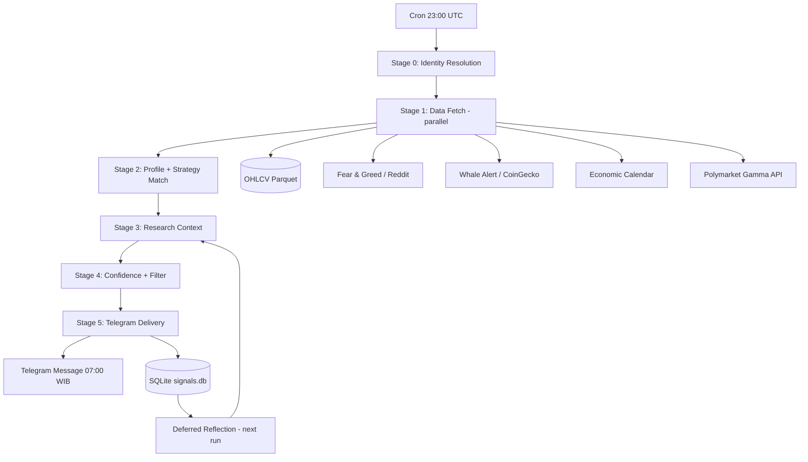

# ARCHITECTURE SPINE — Trading Signal Bot

## Paradigm

**Pipeline Architecture (Batch Processing).** A nightly cron triggers a linear stage-gated pipeline. Each stage is a pure function: input data → output artifacts. No real-time WebSocket. No request-response API serving users. The pipeline terminates when the Telegram message is sent. State between runs is stored in SQLite + Parquet files.

**Why not microservices** — not needed for single-user batch job.
**Why not event-driven** — no real-time requirement; batch is simpler, debuggable, cheaper.
**Why not FastAPI server** — the pipeline IS the app; Telegram bot is a thin sender wrapper, not a webhook server.

---

## Invariants (AD — Architecture Decisions)

### AD-1: Deterministic Backbone, LLM as Reflector

**Binds:** LLM may ONLY be used for deferred outcome reflection (post-signal analysis). LLM MUST NOT participate in signal generation, confidence scoring, or strategy matching.

**Prevents:** LLM hallucination contaminating signal output. Non-deterministic confidence scores. Cost escalation from per-signal LLM calls.

**Rule:** If code path generates a signal → no `ChatLLM` import allowed. Reflection path uses `ChatLLM` with 3s timeout, fallback to skip.

**[ADOPTED]** — from PRD FR6, brainstorming inversion analysis.

---

### AD-2: Parquet as Canonical Data Store, SQLite as Metadata Store

**Binds:** OHLCV data stored as Parquet files (`data/ohlcv/{symbol}.parquet`). Signal history, outcomes, reflections in SQLite (`data/signals.db`). Parquet is immutable append — new data appends, old data never modified. SQLite is the source of truth for signal metadata.

**Prevents:** Data corruption from partial writes. Schema drift (Parquet is self-describing). Heavy DB dependency (no Postgres needed for single-user).

**Rule:** Any code that reads OHLCV reads from Parquet. Any code that writes signal state writes to SQLite. No cross-contamination.

**[ADOPTED]** — environment has no Redis, 18GB free disk. Parquet compress 10:1 vs CSV.

---

### AD-3: Pipeline Stages as Pure Functions with Filesystem I/O

**Binds:** Each pipeline stage is a pure function `stage(input_path: Path) → output_path: Path`. Input is a directory of artifacts from previous stage. Output is a directory for next stage. No shared mutable state between stages.

**Prevents:** Stage coupling. Difficult debugging (each stage output is inspectable on disk). Non-reproducible runs (same input → same output, plus time).

**Rule:** Stage MUST NOT import from another stage module. Communication ONLY through filesystem artifacts (JSON, Parquet). Logging is the exception — shared logger instance via stdlib `logging`.

**[ADOPTED]** — from PRD architecture outline (6 stages), Vibe-Trading runner pattern.

---

### AD-4: CCXT as Exchange Abstraction with Ordered Fallback

**Binds:** All exchange data fetches go through CCXT unified API. Fallback chain: `Binance → OKX → CoinGecko`. CCXT handles rate limiting, retry, and exchange-specific quirks.

**Prevents:** Exchange-specific code leaking into pipeline. Single point of failure (Binance maintenance).

**Rule:** `ExchangeRouter.fetch_ohlcv(symbol, timeframe, since)` wraps CCXT with the fallback chain. No direct exchange API calls anywhere else.

**[ADOPTED]** — Vibe-Trading uses CCXT with fallback; TradingAgents uses vendor routing. CCXT is installed and working in this environment.

---

### AD-5: Strategy as Pure Function Interface

**Binds:** Every strategy implements `StrategyProtocol`: `evaluate(ohlcv: pd.DataFrame, indicators: dict) → StrategySignal`. Input is historical OHLCV + pre-computed indicators. Output is a dataclass with `action`, `confidence`, `entry_price`, `stop_loss`, `take_profit`.

**Prevents:** Strategy implementations with side effects (API calls, DB writes). Inconsistent output shapes. Difficult backtesting.

**Rule:** Strategy module imports ONLY from `numpy`, `pandas`, and `src/indicators.py`. No network, no disk, no LLM.

**[ADOPTED]** — from PRD FR2.2, consistent with Vibe-Trading backtest engine design.

---

### AD-6: Indicator Engine Pre-Computes Once

**Binds:** All indicators (RSI, MACD, ATR, ADX, Bollinger, MA, Volume) are computed ONCE per pair at stage entry, stored as Parquet columns alongside OHLCV. Strategies receive the pre-computed indicator dict — they do NOT re-compute.

**Prevents:** Duplicate computation across 5 strategies × 100 pairs. Inconsistent indicator implementations across strategies.

**Rule:** `src/indicators.py` exports `compute_all(ohlcv) → dict[str, pd.Series]`. Pure numpy/pandas implementation — no external TA library dependency (Python 3.14 compatibility). Strategies access via dict keys, not method calls.

**[ADOPTED]** — pure numpy/pandas verified and working. Vibe-Trading uses same pattern.

---

### AD-7: Telegram as Fire-and-Forget Delivery

**Binds:** Telegram bot sends ONE message per day via `python-telegram-bot` library. No webhook — bot is a sender, not a listener. No inline button handling (no trading execution). If send fails → log error, retry 3× with exponential backoff.

**Prevents:** Complex bot state management. Webhook infrastructure. User expectation of interactivity.

**Rule:** `src/telegram_sender.py` exposes `send_daily_signals(signals: list[Signal]) → bool`. Single function, single responsibility.

**[ADOPTED]** — PRD scope: single user, daily batch, no execution. python-telegram-bot installed.

---

### AD-8: SQLite Schema — 4 Tables

**Binds:** Database has exactly 4 tables:
```
signals       — id, symbol, action, confidence, entry_price, sl, tp,
                strategy, sentiment_score, onchain_signal, macro_flag,
                timestamp_utc, status (pending|resolved)
                
outcomes      — signal_id FK, realized_return_pct, price_at_resolution,
                resolved_at, reflection_text
                
run_log       — id, started_at, completed_at, pairs_analyzed,
                signals_generated, errors_json
                
weights       — weight_id TEXT PK, value REAL, updated_at TEXT
                (added by Epic 3 for dynamic research source weights)
```

**Prevents:** Schema sprawl. ORM complexity.

**Rule:** No migrations framework needed — SQLite, single-user. Schema created via `sqlite3` module `CREATE TABLE IF NOT EXISTS`. Add column = manual `ALTER TABLE`.

**[ADOPTED]** — PRD FR6 requires outcome tracking. SQLite verified available via Python stdlib.

---

## Deferred (Intentionally not decided)

- **D-1: Web dashboard** — out of PRD scope. If added, serve static HTML from Parquet/SQLite, no API server needed.
- **D-2: Multi-user support** — out of PRD scope. If added, user_id column in signals table + per-user Telegram config.
- **D-3: Real-time signals** — out of PRD scope. Would require WebSocket architecture (AD-1 paradigm would change).
- **D-4: Paid data sources** — free sources sufficient for MVP. Glassnode, FRED auth deferred.
- **D-5: Docker deployment** — Docker available in environment but not needed for single-machine cron job.

---

## Seed: Project Structure

```
trading-signal/
├── src/
│   ├── pipeline/
│   │   ├── stage_0_identity.py    # Ticker resolution + filtering
│   │   ├── stage_1_fetch.py       # OHLCV, sentiment, on-chain, macro, polymarket
│   │   ├── stage_2_profile.py     # 4D profile + strategy matching
│   │   ├── stage_3_research.py    # Research multiplier computation
│   │   ├── stage_4_confidence.py  # Final confidence + filter
│   │   └── stage_5_deliver.py     # Telegram send
│   ├── strategies/
│   │   ├── base.py                # StrategyProtocol
│   │   ├── momentum.py
│   │   ├── trend_following.py
│   │   ├── mean_reversion.py
│   │   ├── volatility_breakout.py
│   │   └── volume_divergence.py
│   ├── indicators.py              # pure numpy/pandas implementation (no pandas-ta)
│   ├── backtest.py                # Backtest runner + metrics
│   ├── profile.py                 # 4D profile computation
│   ├── research.py                # Sentiment, on-chain, macro scoring
│   ├── reflection.py              # LLM deferred reflection
│   ├── telegram_sender.py         # python-telegram-bot wrapper
│   ├── db.py                      # SQLite read/write
│   └── exchange.py                # CCXT router with fallback
├── data/
│   ├── ohlcv/                     # {symbol}.parquet
│   └── signals.db                 # SQLite
├── config/
│   └── settings.yaml              # Watchlist, thresholds, API endpoints
├── main.py                        # Entry point: cron → run_pipeline()
├── .env                           # API keys (gitignored)
└── requirements.txt               # ccxt, pandas, pyarrow,
                                   # python-telegram-bot, apscheduler, requests
```

---

## Seed: Data Flow (per pair, single stage)

```
Stage N input dir/
  └── {symbol}/
      ├── ohlcv.parquet
      ├── indicators.parquet
      └── metadata.json

        ▼  stage function

Stage N+1 output dir/
  └── {symbol}/
      ├── [inherited from input]
      └── stage_output.json   ← new artifact
```

Last stage produces `signals.json` — list of all passing signals → Telegram.

---

## Seed: Key Interfaces

```python
# Strategy Protocol
@dataclass
class StrategySignal:
    action: Literal["BUY", "SELL", "HOLD"]
    confidence: float          # 0.0 - 1.0
    entry_price: float
    stop_loss: float
    take_profit: float | None

class StrategyProtocol(Protocol):
    name: str
    weight: float
    def evaluate(self, ohlcv: pd.DataFrame, indicators: dict) -> StrategySignal: ...

# Pipeline Stage
def stage(input_dir: Path, output_dir: Path, config: dict) -> None: ...

# Exchange Router
class ExchangeRouter:
    def fetch_ohlcv(self, symbol: str, timeframe: str, since_ms: int) -> pd.DataFrame: ...
    # Fallback: Binance → OKX → CoinGecko

# Signal (DB row)
@dataclass
class Signal:
    id: str
    symbol: str
    action: str
    confidence: float
    entry_price: float
    stop_loss: float
    take_profit: float | None
    strategy: str
    sentiment_score: float | None
    onchain_signal: str | None      # "bullish"|"bearish"|"neutral"
    macro_flag: bool                 # True if high-impact event nearby
    timestamp_utc: datetime
    status: str                      # "pending"|"resolved"
```

---

## Diagrams

### Pipeline Flow (Mermaid)


